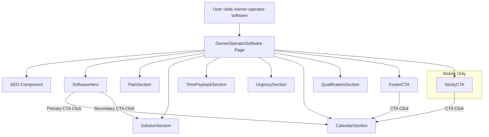
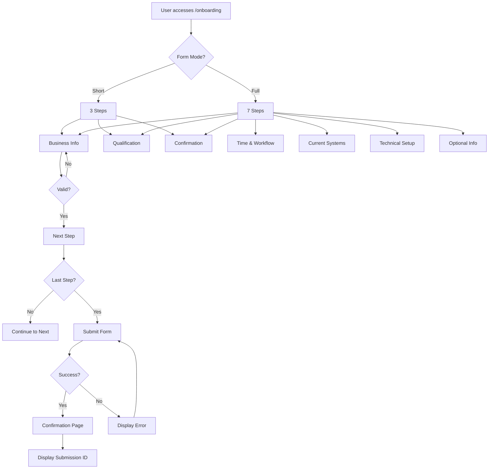

# Design Document: Owner-Operator Software Landing Page

## Overview

This document describes the technical design for a conversion-focused landing page targeting owner-operators at `/owner-operator-software`. The page will follow the existing San Gabriel website architecture using React, React Router, Framer Motion for animations, and Tailwind CSS for styling. The design prioritizes conversion through clear value proposition, emotional connection, urgency, and easy calendar booking access.

## Architecture

The page follows the existing San Gabriel website architecture:

```
┌─────────────────────────────────────────────────────────────┐
│                         App.jsx                              │
│  ┌─────────────────────────────────────────────────────────┐│
│  │                      Router                              ││
│  │  ┌─────────────────────────────────────────────────────┐││
│  │  │ /owner-operator-software → OwnerOperatorSoftware.jsx│││
│  │  └─────────────────────────────────────────────────────┘││
│  └─────────────────────────────────────────────────────────┘│
└─────────────────────────────────────────────────────────────┘
```

### Page Component Structure

```
OwnerOperatorSoftware.jsx
├── SEO (meta tags, structured data)
├── SoftwareHero (hero section with CTAs)
├── PainSection (pain points)
├── SolutionSection (what the software does)
├── TimePaybackSection (time savings visualization)
├── UrgencySection (First 100 free offer)
├── CalendarSection (booking integration)
├── QualificationSection (who it's for)
├── FooterCTA (final call-to-action)
└── StickyCTA (mobile-only floating button)
```

## Components and Interfaces

### 1. OwnerOperatorSoftware Page Component

**File:** `src/pages/OwnerOperatorSoftware.jsx`

```jsx
// Main page component that composes all sections
const OwnerOperatorSoftware = () => {
  return (
    <div className="pt-20">
      <SEO 
        title="Software Built for Owner-Operators — Save Hours Every Week"
        description="Automate daily tasks, reduce manual work, and free up hours every week. Free for the first 100 owner-operators."
      />
      <SoftwareHero />
      <PainSection />
      <SolutionSection />
      <TimePaybackSection />
      <UrgencySection />
      <CalendarSection />
      <QualificationSection />
      <FooterCTA />
      <StickyCTA />
    </div>
  );
};
```

### 2. SoftwareHero Component

**File:** `src/components/sections/owner-operator/SoftwareHero.jsx`

**Props:** None (uses static content from data file)

**Behavior:**
- Displays headline, subheadline, trust line
- Primary CTA scrolls to calendar section
- Secondary CTA scrolls to solution section
- Uses Framer Motion for entrance animations
- Follows existing hero pattern with gradient background

### 3. PainSection Component

**File:** `src/components/sections/owner-operator/PainSection.jsx`

**Props:** None (uses static content from data file)

**Behavior:**
- Displays section title and pain point bullets
- Uses icons for visual representation
- Displays bridge statement
- Scroll reveal animation on viewport entry

### 4. SolutionSection Component

**File:** `src/components/sections/owner-operator/SolutionSection.jsx`

**Props:** None (uses static content from data file)

**Behavior:**
- Displays capabilities and outcomes in two columns
- Uses icons for time, automation, control concepts
- Scroll reveal with staggered animation for list items

### 5. TimePaybackSection Component

**File:** `src/components/sections/owner-operator/TimePaybackSection.jsx`

**Props:** None (uses static content from data file)

**Behavior:**
- Displays time savings examples in a grid
- Uses icons for each example
- Displays positioning line
- Scroll reveal animation

### 6. UrgencySection Component

**File:** `src/components/sections/owner-operator/UrgencySection.jsx`

**Props:** None (uses static content from data file)

**Behavior:**
- Displays "First 100" offer details
- Uses accent colors to create urgency
- Displays trust reinforcement text
- Scroll reveal animation

### 7. CalendarSection Component

**File:** `src/components/sections/owner-operator/CalendarSection.jsx`

**Props:**
- `calendarScriptUrl?: string` - Optional calendar embed script URL

**Behavior:**
- Displays 3-step process
- Contains placeholder for calendar widget
- CTA button scrolls to calendar embed area
- Uses `id="calendar-section"` for scroll targeting

### 8. QualificationSection Component

**File:** `src/components/sections/owner-operator/QualificationSection.jsx`

**Props:** None (uses static content from data file)

**Behavior:**
- Two-column layout: "For" and "Not For"
- Uses check/x icons for visual distinction
- Scroll reveal animation

### 9. FooterCTA Component

**File:** `src/components/sections/owner-operator/FooterCTA.jsx`

**Props:** None

**Behavior:**
- Full-width CTA section with gradient background
- Button scrolls to calendar section
- Scroll reveal animation

### 10. StickyCTA Component

**File:** `src/components/sections/owner-operator/StickyCTA.jsx`

**Props:** None

**Behavior:**
- Fixed position at bottom of screen
- Only visible on mobile (< 768px viewport)
- Scrolls to calendar section on click
- Uses z-index to stay above content
- Subtle shadow for visibility

### 11. Data File

**File:** `src/data/ownerOperatorContent.js`

```javascript
export const ownerOperatorContent = {
  hero: {
    headline: "This Software Gives Owner-Operators Their Time Back",
    subheadline: "Automate daily tasks, reduce manual work, and free up hours every week—so you can focus on real business problems, not admin work.",
    trustLine: "Built specifically for owner-operators who do everything themselves.",
    primaryCTA: "Get Free Access (First 100 Only)",
    secondaryCTA: "See How It Works"
  },
  pain: {
    title: "Owner-Operators Are Losing Time Where It Hurts Most",
    points: [
      { text: "Too many systems that don't talk to each other", icon: "disconnect" },
      { text: "Repeating the same tasks every day", icon: "repeat" },
      { text: "Paperwork, tracking, follow-ups eating into nights and weekends", icon: "paperwork" },
      { text: "No time left to solve bigger business problems", icon: "time" }
    ],
    bridgeStatement: "Time isn't just money—it's your ability to think, plan, and grow."
  },
  solution: {
    title: "One Software. Fewer Tasks. More Control.",
    capabilities: [
      { text: "Centralizes key owner-operator workflows", icon: "centralize" },
      { text: "Automates repetitive tasks", icon: "automate" },
      { text: "Keeps critical information organized and accessible", icon: "organize" },
      { text: "Reduces manual tracking and follow-ups", icon: "reduce" }
    ],
    outcomes: [
      { text: "Save hours every week", icon: "clock" },
      { text: "Fewer mistakes", icon: "check" },
      { text: "Less stress", icon: "calm" },
      { text: "More time to fix real operational problems", icon: "fix" }
    ]
  },
  timePayback: {
    title: "What Would You Do With 5–10 Hours Back Every Week?",
    examples: [
      { text: "Fix cash flow issues", icon: "money" },
      { text: "Improve operations", icon: "operations" },
      { text: "Spend time with family", icon: "family" },
      { text: "Take on more profitable work", icon: "profit" },
      { text: "Actually plan instead of reacting", icon: "plan" }
    ],
    positioningLine: "This software doesn't just save time—it gives you decision-making space."
  },
  urgency: {
    title: "Free for the First 100 Owner-Operators",
    points: [
      "Early adopters get full access at no cost",
      "Limited to first 100 to ensure proper onboarding and support",
      "No long-term commitment required"
    ],
    trustReinforcement: "We're rolling this out with real operators first to refine it around real-world use."
  },
  calendar: {
    title: "How It Works",
    steps: [
      { number: 1, text: "Book a short call using the calendar below" },
      { number: 2, text: "We confirm you're a good fit" },
      { number: 3, text: "Get access and start saving time" }
    ],
    ctaText: "Book My Free Access Call"
  },
  qualification: {
    title: "Is This for You?",
    forYou: [
      "Owner-operators",
      "Small business owners wearing multiple hats",
      "Operators tired of admin overload"
    ],
    notForYou: [
      "Large corporate teams",
      "Businesses that don't value time efficiency"
    ]
  },
  footerCTA: {
    headline: "Stop Spending Time on Work Software Should Be Doing",
    ctaText: "Claim My Free Spot (First 100)"
  },
  stickyCTA: {
    text: "Get Free Access"
  }
};
```

## Data Models

### Content Structure

The page uses a centralized content data file (`ownerOperatorContent.js`) that contains all text content, making it easy to update copy without modifying component code.

### Scroll Target IDs

| Section | ID | Purpose |
|---------|-----|---------|
| Solution | `solution-section` | Secondary CTA target |
| Calendar | `calendar-section` | Primary CTA target |

## Correctness Properties

*A property is a characteristic or behavior that should hold true across all valid executions of a system-essentially, a formal statement about what the system should do. Properties serve as the bridge between human-readable specifications and machine-verifiable correctness guarantees.*

### Property 1: Route Accessibility

*For any* valid navigation to `/owner-operator-software`, the OwnerOperatorSoftware page component SHALL be rendered with all required section components.

**Validates: Requirements 1.1, 1.4**

### Property 2: CTA Scroll Navigation

*For any* CTA button (primary hero CTA, secondary hero CTA, footer CTA, or sticky CTA) that is clicked, the page SHALL scroll to bring the target section (calendar-section or solution-section) into the viewport.

**Validates: Requirements 2.6, 2.7, 9.3, 10.4**

### Property 3: Mobile Sticky CTA Visibility

*For any* viewport width less than 768px, the StickyCTA component SHALL be visible and fixed at the bottom of the screen. *For any* viewport width greater than or equal to 768px, the StickyCTA component SHALL be hidden.

**Validates: Requirements 10.1, 10.2**

### Property 4: Content Completeness

*For any* section component rendered on the page, all required text content defined in the ownerOperatorContent data file SHALL be present in the DOM, including all headlines, bullet points, and CTA button text.

**Validates: Requirements 2.1-2.5, 3.1-3.3, 4.1-4.3, 5.1-5.3, 6.1-6.3, 7.1-7.4, 8.1-8.3, 9.1-9.2, 10.3**

### Property 5: SEO Meta Tags

*For any* page load of `/owner-operator-software`, the document title SHALL be set to "Software Built for Owner-Operators — Save Hours Every Week" and a meta description tag SHALL be present with non-empty content.

**Validates: Requirements 1.2, 1.3**

### Property 6: Accessibility Heading Hierarchy

*For any* rendered page, heading elements SHALL follow proper hierarchy where h1 appears exactly once, h2 elements follow h1, and h3 elements follow h2, with no skipped levels.

**Validates: Requirements 12.2**

### Property 7: Keyboard Accessibility

*For any* interactive element (button, link) on the page, the element SHALL be focusable via keyboard navigation and SHALL have appropriate ARIA labels or accessible names.

**Validates: Requirements 12.4, 12.5**

## Error Handling

### Missing Calendar Script

When no calendar script URL is provided:
- Display a placeholder message: "Calendar booking coming soon"
- Show a fallback CTA linking to the contact page

### Animation Fallbacks

When user prefers reduced motion:
- All Framer Motion animations use `duration: 0.01`
- Parallax effects are disabled
- Scroll reveal animations show content immediately

### Content Loading

All content is statically imported from the data file, eliminating loading states. If content is missing:
- Components render with empty strings
- No runtime errors occur

## Testing Strategy

### Unit Tests

Unit tests will verify:
- Component rendering with expected content
- CTA button click handlers
- Responsive visibility of StickyCTA
- SEO component meta tag updates
- Form field validation logic
- Form step navigation
- Conditional field display

### Property-Based Tests

Property-based tests will verify:
- **Landing Page Properties:**
  - Route accessibility (Property 1)
  - CTA scroll navigation (Property 2)
  - Mobile sticky CTA visibility (Property 3)
  - Content completeness (Property 4)
  - SEO meta tags (Property 5)
  - Accessibility heading hierarchy (Property 6)
  - Keyboard accessibility (Property 7)
- **Onboarding Form Properties:**
  - Required field validation (Property 8)
  - Email confirmation match (Property 9)
  - Form version step inclusion (Property 10)
  - Data persistence on error (Property 11)
  - Consent checkbox requirement (Property 12)
  - Optional field submission (Property 13)
  - Submission ID generation (Property 14)
  - Form accessibility (Property 15)
  - Form field data collection and storage (Property 16)
  - Qualification disqualification message (Property 17)
  - Email difference confirmation (Property 18)
  - Calendar call information display (Property 19)
  - Data encryption at rest (Property 20)
  - Form responsiveness (Property 21)
  - Progress indicator updates (Property 22)

### Testing Framework

- **Unit Tests:** Jest + React Testing Library
- **Property Tests:** fast-check for property-based testing
- **Minimum iterations:** 100 per property test

### Test File Structure

```
src/
├── pages/
│   ├── OwnerOperatorSoftware.jsx
│   ├── OwnerOperatorSoftware.test.js
│   ├── OnboardingForm.jsx
│   └── OnboardingForm.test.js
├── components/
│   ├── sections/owner-operator/
│   │   ├── SoftwareHero.jsx
│   │   ├── SoftwareHero.test.js
│   │   └── ...
│   └── forms/onboarding/
│       ├── BusinessInformationStep.jsx
│       ├── BusinessInformationStep.test.js
│       └── ...
├── data/
│   ├── ownerOperatorContent.js
│   ├── ownerOperatorContent.test.js
│   ├── onboardingFormConfig.js
│   └── onboardingFormConfig.test.js
└── services/
    ├── onboardingService.js
    └── onboardingService.test.js
```

## Visual Design Specifications

### Color Palette

Following existing San Gabriel design system:
- Primary gradient: `from-primary-900 via-primary-800 to-primary-900`
- Accent color: `accent-500` (orange) for CTAs
- Background alternation: `bg-white` and `bg-neutral-50`
- Text: `text-primary-900` (headings), `text-neutral-600` (body)

### Typography

- Hero headline: `text-4xl md:text-5xl lg:text-6xl font-bold`
- Section titles: `text-3xl md:text-4xl font-bold`
- Body text: `text-lg text-neutral-600`
- CTA buttons: `text-lg font-semibold`

### Spacing

- Section padding: `py-20`
- Container max-width: `max-w-6xl mx-auto px-4 sm:px-6 lg:px-8`
- Element spacing: `mb-6`, `mb-8`, `mb-12` for vertical rhythm

### Icons

Using `react-icons/hi` (Heroicons) for consistency:
- `HiOutlineClock` - time
- `HiOutlineCog` - automation
- `HiOutlineShieldCheck` - control
- `HiOutlineCheck` - checkmarks
- `HiOutlineX` - not for you items
- `HiOutlineCalendar` - calendar/booking

### Animations

Following existing animation patterns:
- Entrance: `fadeUp` with `duration: 0.6`
- Stagger delay: `0.1s` between items
- Easing: `[0.25, 0.46, 0.45, 0.94]` (smooth)
- Reduced motion: instant transitions

## Mermaid Diagram: Component Flow




---

# Onboarding Form Design

## Overview

This section describes the technical design for the owner-operator onboarding form system. The form collects business information, qualification data, and consent during the onboarding process. The design supports three form versions: a short form for calendar calls, a full form for post-approval onboarding, and a standalone web form accessible via URL.

## Architecture Extension

The onboarding form extends the existing architecture:

```
┌─────────────────────────────────────────────────────────────┐
│                         App.jsx                              │
│  ┌─────────────────────────────────────────────────────────┐│
│  │                      Router                              ││
│  │  ┌─────────────────────────────────────────────────────┐││
│  │  │ /owner-operator-software → Landing Page             │││
│  │  │ /onboarding → OnboardingForm.jsx                    │││
│  │  │ /onboarding/short → OnboardingForm.jsx (short mode) │││
│  │  └─────────────────────────────────────────────────────┘││
│  └─────────────────────────────────────────────────────────┘│
└─────────────────────────────────────────────────────────────┘
```

### Form Component Structure

```
OnboardingForm.jsx
├── SEO (meta tags)
├── FormHeader (title, progress indicator)
├── FormSteps (multi-step form container)
│   ├── Step 1: Business Information
│   ├── Step 2: Qualification
│   ├── Step 3: Time & Workflow Assessment
│   ├── Step 4: Current Systems
│   ├── Step 5: Technical Setup
│   ├── Step 6: Confirmation & Consent
│   └── Step 7: Optional Information
├── FormNavigation (back/next buttons)
└── FormSubmission (submit button, confirmation)
```

## Components and Interfaces

### 1. OnboardingForm Page Component

**File:** `src/pages/OnboardingForm.jsx`

**Props:**
- `mode?: 'short' | 'full'` - Form version (default: 'full')
- `prefilledData?: Partial<OnboardingData>` - Pre-populated form data

**State:**
```typescript
interface OnboardingData {
  // Business Information
  legalBusinessName: string;
  tradeName?: string;
  ownerFullName: string;
  email: string;
  phone: string;
  businessAddress: string;
  businessType: string;
  yearsInOperation: number;
  
  // Qualification
  isPrimaryOperator: boolean;
  numberOfEmployees: number;
  responsibleForDailyOps: boolean;
  handlesAdminWork: boolean;
  
  // Time & Workflow
  hoursPerWeekOnAdmin: number;
  top3RepetitiveTasks: string[];
  biggestTimeDrain: string;
  problemToSolveWithExtraTime: string;
  
  // Current Systems
  currentAccountingSoftware: string;
  currentSchedulingSoftware: string;
  currentCRM: string;
  usesSpreadsheets: boolean;
  usesMultipleToolsForSameTask: boolean;
  hasFullyManualTasks: boolean;
  
  // Technical Setup
  preferredEmail: string;
  needsSecondaryUser: boolean;
  primaryDevice: 'Mobile' | 'Desktop' | 'Tablet';
  operatingSystem: 'iOS' | 'Android' | 'Windows' | 'Mac';
  
  // Confirmation & Consent
  understandsFirst100Limit: boolean;
  understandsEarlyAdoption: boolean;
  understandsFeedbackRequest: boolean;
  scheduledCallDateTime: string;
  timeZone: string;
  bestContactMethod: string;
  agreesToAttendOrReschedule: boolean;
  consentsToStoreInfo: boolean;
  consentsToContact: boolean;
  agreesToTerms: boolean;
  optInToUpdates: boolean;
  
  // Optional
  willingToProvideFeedback?: boolean;
  interestedInAdvancedFeatures?: boolean;
  interestedInConsulting?: boolean;
}
```

**Behavior:**
- Determines form version based on route or mode prop
- Manages multi-step form state
- Validates each step before allowing progression
- Submits data to backend API
- Displays confirmation on successful submission

### 2. FormHeader Component

**File:** `src/components/forms/onboarding/FormHeader.jsx`

**Props:**
- `currentStep: number`
- `totalSteps: number`
- `mode: 'short' | 'full'`

**Behavior:**
- Displays form title based on mode
- Shows progress indicator (step X of Y)
- Visual progress bar

### 3. FormSteps Components

Each step is a separate component for modularity:

#### BusinessInformationStep

**File:** `src/components/forms/onboarding/BusinessInformationStep.jsx`

**Props:**
- `data: Partial<OnboardingData>`
- `onChange: (field: string, value: any) => void`
- `errors: Record<string, string>`

**Fields:**
- Legal Business Name (required)
- Operating/Trade Name (optional)
- Owner Full Name (required)
- Email Address (required, validated)
- Phone Number (required, formatted)
- Business Address (required)
- Business Type/Industry (required, dropdown)
- Years in Operation (required, number input)

**Validation:**
- Email format validation
- Phone number format validation
- All required fields must be non-empty

#### QualificationStep

**File:** `src/components/forms/onboarding/QualificationStep.jsx`

**Props:** Same as BusinessInformationStep

**Fields:**
- Are you the primary operator? (Yes/No radio)
- Number of employees (number input)
- Responsible for daily operations? (Yes/No radio)
- Handle admin/scheduling/reporting? (Yes/No radio)

**Behavior:**
- If qualification fails (not primary operator), display eligibility message
- Allow user to continue but flag for review

#### TimeWorkflowStep

**File:** `src/components/forms/onboarding/TimeWorkflowStep.jsx`

**Props:** Same as BusinessInformationStep

**Fields:**
- Hours per week on admin (number input with slider)
- Top 3 repetitive tasks (3 text inputs)
- Biggest time drain (textarea)
- Problem to solve with extra time (textarea)

**Validation:**
- All fields required
- Character limits on text areas (500 chars)

#### CurrentSystemsStep

**File:** `src/components/forms/onboarding/CurrentSystemsStep.jsx`

**Props:** Same as BusinessInformationStep

**Fields:**
- Current accounting software (text input, allow "None")
- Current scheduling software (text input, allow "None")
- Current CRM (text input, allow "None")
- Use spreadsheets/manual tracking? (checkbox)
- Multiple tools for same task? (Yes/No radio)
- Any fully manual tasks? (Yes/No radio)

#### TechnicalSetupStep

**File:** `src/components/forms/onboarding/TechnicalSetupStep.jsx`

**Props:** Same as BusinessInformationStep

**Fields:**
- Preferred email for software access (email input)
- Confirm email (email input, must match)
- Need secondary user? (Yes/No radio)
- Primary device (dropdown: Mobile/Desktop/Tablet)
- Operating system (dropdown: iOS/Android/Windows/Mac)

**Validation:**
- Email confirmation must match
- Display warning if preferred email differs from contact email

#### ConfirmationConsentStep

**File:** `src/components/forms/onboarding/ConfirmationConsentStep.jsx`

**Props:** Same as BusinessInformationStep

**Fields:**
- Display scheduled call date/time (read-only)
- Time zone (dropdown)
- Best contact method (dropdown: Phone/Email/Text)
- Agreement to attend or reschedule (checkbox, required)
- Eligibility confirmation checkboxes (3 required):
  - Limited to first 100 owner-operators
  - Free access is early adoption
  - Feedback may be requested
- Consent checkboxes (3 required):
  - Consent to store business information
  - Consent to be contacted for onboarding/support
  - Agreement to basic software terms
- Optional consent:
  - Receive updates or improvements (checkbox)
- Links to Privacy Policy and Terms of Service

**Validation:**
- All required checkboxes must be checked
- Cannot proceed without required consents

#### OptionalInformationStep

**File:** `src/components/forms/onboarding/OptionalInformationStep.jsx`

**Props:** Same as BusinessInformationStep

**Fields:**
- Willing to provide feedback/testimonial? (Yes/No/Maybe radio)
- Interest in advanced features? (Yes/No/Maybe radio)
- Interest in consulting support? (Yes/No/Maybe radio)

**Behavior:**
- Clearly marked as optional
- Can skip entirely
- No validation required

### 4. FormNavigation Component

**File:** `src/components/forms/onboarding/FormNavigation.jsx`

**Props:**
- `currentStep: number`
- `totalSteps: number`
- `onBack: () => void`
- `onNext: () => void`
- `canProceed: boolean`
- `isLastStep: boolean`

**Behavior:**
- Back button (disabled on first step)
- Next button (disabled if validation fails)
- Submit button (only on last step)
- Keyboard navigation support (Enter to proceed)

### 5. FormSubmission Component

**File:** `src/components/forms/onboarding/FormSubmission.jsx`

**Props:**
- `onSubmit: () => Promise<void>`
- `isSubmitting: boolean`
- `error?: string`

**Behavior:**
- Submit button with loading state
- Error message display
- Success confirmation with submission ID
- Redirect to confirmation page on success

### 6. Form Data Service

**File:** `src/services/onboardingService.js`

```javascript
export const onboardingService = {
  // Submit form data
  async submitOnboarding(data) {
    const response = await fetch('/api/onboarding', {
      method: 'POST',
      headers: { 'Content-Type': 'application/json' },
      body: JSON.stringify(data)
    });
    
    if (!response.ok) {
      throw new Error('Submission failed');
    }
    
    return response.json(); // Returns { submissionId, success }
  },
  
  // Validate email uniqueness
  async checkEmailAvailability(email) {
    const response = await fetch(`/api/onboarding/check-email?email=${email}`);
    return response.json(); // Returns { available: boolean }
  },
  
  // Save draft (auto-save)
  async saveDraft(data) {
    localStorage.setItem('onboarding-draft', JSON.stringify(data));
  },
  
  // Load draft
  loadDraft() {
    const draft = localStorage.getItem('onboarding-draft');
    return draft ? JSON.parse(draft) : null;
  },
  
  // Clear draft
  clearDraft() {
    localStorage.removeItem('onboarding-draft');
  }
};
```

### 7. Form Configuration Data

**File:** `src/data/onboardingFormConfig.js`

```javascript
export const onboardingFormConfig = {
  shortForm: {
    steps: [
      'businessInformation',
      'qualification',
      'confirmationConsent'
    ],
    title: 'Quick Onboarding Form',
    description: 'Complete this short form during your calendar call'
  },
  fullForm: {
    steps: [
      'businessInformation',
      'qualification',
      'timeWorkflow',
      'currentSystems',
      'technicalSetup',
      'confirmationConsent',
      'optionalInformation'
    ],
    title: 'Owner-Operator Onboarding',
    description: 'Help us set up your account and understand your needs'
  },
  businessTypes: [
    'Trucking/Transportation',
    'Construction',
    'Landscaping',
    'Plumbing',
    'Electrical',
    'HVAC',
    'General Contracting',
    'Other'
  ],
  devices: ['Mobile', 'Desktop', 'Tablet'],
  operatingSystems: ['iOS', 'Android', 'Windows', 'Mac'],
  contactMethods: ['Phone', 'Email', 'Text Message'],
  timeZones: [
    'America/New_York',
    'America/Chicago',
    'America/Denver',
    'America/Los_Angeles',
    'America/Toronto',
    'America/Vancouver'
  ]
};
```

## Data Models

### OnboardingData Interface

See the TypeScript interface defined in the OnboardingForm component above.

### API Request/Response

**POST /api/onboarding**

Request:
```json
{
  "legalBusinessName": "string",
  "tradeName": "string?",
  "ownerFullName": "string",
  "email": "string",
  "phone": "string",
  "businessAddress": "string",
  "businessType": "string",
  "yearsInOperation": "number",
  "isPrimaryOperator": "boolean",
  "numberOfEmployees": "number",
  "responsibleForDailyOps": "boolean",
  "handlesAdminWork": "boolean",
  "hoursPerWeekOnAdmin": "number",
  "top3RepetitiveTasks": ["string", "string", "string"],
  "biggestTimeDrain": "string",
  "problemToSolveWithExtraTime": "string",
  "currentAccountingSoftware": "string",
  "currentSchedulingSoftware": "string",
  "currentCRM": "string",
  "usesSpreadsheets": "boolean",
  "usesMultipleToolsForSameTask": "boolean",
  "hasFullyManualTasks": "boolean",
  "preferredEmail": "string",
  "needsSecondaryUser": "boolean",
  "primaryDevice": "string",
  "operatingSystem": "string",
  "understandsFirst100Limit": "boolean",
  "understandsEarlyAdoption": "boolean",
  "understandsFeedbackRequest": "boolean",
  "scheduledCallDateTime": "string (ISO 8601)",
  "timeZone": "string",
  "bestContactMethod": "string",
  "agreesToAttendOrReschedule": "boolean",
  "consentsToStoreInfo": "boolean",
  "consentsToContact": "boolean",
  "agreesToTerms": "boolean",
  "optInToUpdates": "boolean",
  "willingToProvideFeedback": "boolean?",
  "interestedInAdvancedFeatures": "boolean?",
  "interestedInConsulting": "boolean?"
}
```

Response (Success):
```json
{
  "success": true,
  "submissionId": "uuid",
  "message": "Onboarding form submitted successfully"
}
```

Response (Error):
```json
{
  "success": false,
  "error": "Error message",
  "validationErrors": {
    "email": "Invalid email format",
    "phone": "Invalid phone number"
  }
}
```

## Correctness Properties (Onboarding Form)

### Property 8: Required Field Validation

*For any* form submission attempt, if any required field is empty or invalid, the form SHALL prevent submission and display inline error messages next to the invalid fields.

**Validates: Requirements 13.9, 18.5, 19.5, 20.5**

### Property 9: Email Confirmation Match

*For any* technical setup step completion, if the preferred email and confirmation email do not match exactly, the form SHALL prevent progression to the next step and display an error message.

**Validates: Requirements 17.2, 17.6**

### Property 10: Form Version Step Inclusion

*For any* form rendered in short mode, only steps for business information, qualification, and confirmation/consent SHALL be displayed. *For any* form rendered in full mode, all seven steps SHALL be displayed.

**Validates: Requirements 23.4, 23.5**

### Property 11: Data Persistence on Error

*For any* form submission that fails, all user-entered data SHALL be preserved in the form fields, allowing the user to correct errors without re-entering all information.

**Validates: Requirements 22.5**

### Property 12: Consent Checkbox Requirement

*For any* form submission attempt, if any required consent checkbox (store info, contact, terms) is not checked, the form SHALL prevent submission and highlight the unchecked required consents.

**Validates: Requirements 20.1, 20.2, 20.3, 20.5**

### Property 13: Optional Field Submission

*For any* form submission with optional fields left empty, the submission SHALL succeed and store null or empty values for those fields without validation errors.

**Validates: Requirements 21.4, 21.5**

### Property 14: Submission ID Generation

*For any* successful form submission, the system SHALL generate a unique submission ID and return it in the response, and the confirmation page SHALL display this ID to the user.

**Validates: Requirements 22.3, 22.4**

### Property 15: Form Accessibility

*For any* form field, the field SHALL have an associated label element, support keyboard navigation, and display validation errors in an accessible manner (ARIA live regions).

**Validates: Requirements 24.1, 24.2, 24.4, 24.5**

### Property 16: Form Field Data Collection and Storage

*For any* valid form submission with all required fields completed, the system SHALL accept, store, and retrieve all field values (text, numbers, selections, checkboxes) exactly as entered by the user.

**Validates: Requirements 13.1, 13.2, 13.3, 13.4, 13.5, 13.6, 13.7, 13.8, 15.1, 15.2, 15.3, 15.4, 16.1, 16.2, 16.3, 17.1, 17.4, 17.5, 19.3, 22.2**

### Property 17: Qualification Disqualification Message

*For any* form submission where qualification questions indicate the applicant is not a primary operator (isPrimaryOperator = false OR responsibleForDailyOps = false), the system SHALL display an eligibility message explaining the requirements.

**Validates: Requirements 14.5**

### Property 18: Email Difference Confirmation

*For any* technical setup step where the preferred email address differs from the primary contact email address, the system SHALL display a confirmation message alerting the user to the difference.

**Validates: Requirements 17.6**

### Property 19: Calendar Call Information Display

*For any* form rendering that includes the confirmation/consent step, the scheduled call date/time and time zone SHALL be displayed to the user in a read-only format.

**Validates: Requirements 19.1, 19.2**

### Property 20: Data Encryption at Rest

*For any* form submission containing sensitive information (email, phone number), the system SHALL encrypt these fields before storing them, and the encrypted values SHALL not be readable as plain text in the database.

**Validates: Requirements 22.6**

### Property 21: Form Responsiveness

*For any* viewport width (mobile < 768px, tablet 768-1024px, desktop > 1024px), the form SHALL render with appropriate layout adjustments (single column on mobile, centered on tablet, two-column on desktop) without horizontal scrolling or content overflow.

**Validates: Requirements 24.6**

### Property 22: Progress Indicator Updates

*For any* multi-step form navigation (next or back button click), the progress indicator SHALL update to reflect the current step number and visually indicate completed, current, and future steps.

**Validates: Requirements 24.7**

## Error Handling (Onboarding Form)

### Validation Errors

- Display inline errors next to invalid fields
- Highlight invalid fields with red border
- Prevent form progression until errors are resolved
- Scroll to first error on validation failure

### Network Errors

- Display error message at top of form
- Preserve all entered data
- Provide retry button
- Auto-save draft to localStorage every 30 seconds

### Session Timeout

- Detect inactivity (30 minutes)
- Display warning before timeout (5 minutes remaining)
- Auto-save draft before timeout
- Provide "Continue" button to extend session

### Browser Compatibility

- Graceful degradation for older browsers
- Polyfills for modern JavaScript features
- Fallback for unsupported input types

## Testing Strategy (Onboarding Form)

### Unit Tests

Unit tests will verify:
- Each form step component renders correctly
- Field validation logic (email, phone, required fields)
- Form navigation (back/next buttons)
- Conditional field display based on answers
- Error message display

### Property-Based Tests

Property-based tests will verify:
- Required field validation (Property 8)
- Email confirmation match (Property 9)
- Form version step inclusion (Property 10)
- Data persistence on error (Property 11)
- Consent checkbox requirement (Property 12)
- Optional field submission (Property 13)
- Submission ID generation (Property 14)
- Form accessibility (Property 15)

### Integration Tests

Integration tests will verify:
- Complete form submission flow
- API communication
- Draft auto-save and recovery
- Multi-step navigation
- Conditional logic across steps

### Testing Framework

- **Unit Tests:** Jest + React Testing Library
- **Property Tests:** fast-check for property-based testing
- **Integration Tests:** Cypress or Playwright
- **Minimum iterations:** 100 per property test

## Visual Design Specifications (Onboarding Form)

### Layout

- Single-column layout for mobile
- Two-column layout for desktop (form on left, progress/help on right)
- Max width: 800px for form content
- Sticky progress indicator on desktop

### Form Fields

- Input height: 48px (touch-friendly)
- Label above input (not placeholder-only)
- Helper text below input (gray, smaller font)
- Error text below input (red, with icon)
- Required field indicator: red asterisk

### Progress Indicator

- Step numbers with connecting lines
- Completed steps: green checkmark
- Current step: highlighted
- Future steps: gray

### Buttons

- Primary button: accent color (orange)
- Secondary button: outline style
- Disabled state: gray with reduced opacity
- Loading state: spinner icon

### Spacing

- Form padding: 32px on desktop, 16px on mobile
- Field spacing: 24px vertical gap
- Section spacing: 48px vertical gap
- Button spacing: 16px horizontal gap

### Responsive Breakpoints

- Mobile: < 768px (single column, full width)
- Tablet: 768px - 1024px (single column, centered)
- Desktop: > 1024px (two column layout)

## Mermaid Diagram: Form Flow



## Security Considerations

### Data Encryption

- All form data transmitted over HTTPS
- Sensitive fields (email, phone) encrypted at rest
- Submission IDs use UUID v4 (cryptographically random)

### Input Sanitization

- All text inputs sanitized to prevent XSS
- Phone numbers validated and formatted
- Email addresses validated against RFC 5322

### Rate Limiting

- Maximum 5 submission attempts per IP per hour
- CAPTCHA after 2 failed submissions
- Temporary lockout after 5 failed attempts

### GDPR Compliance

- Clear consent language
- Links to privacy policy and terms
- Right to data deletion (contact support)
- Data retention policy (7 years for business records)
